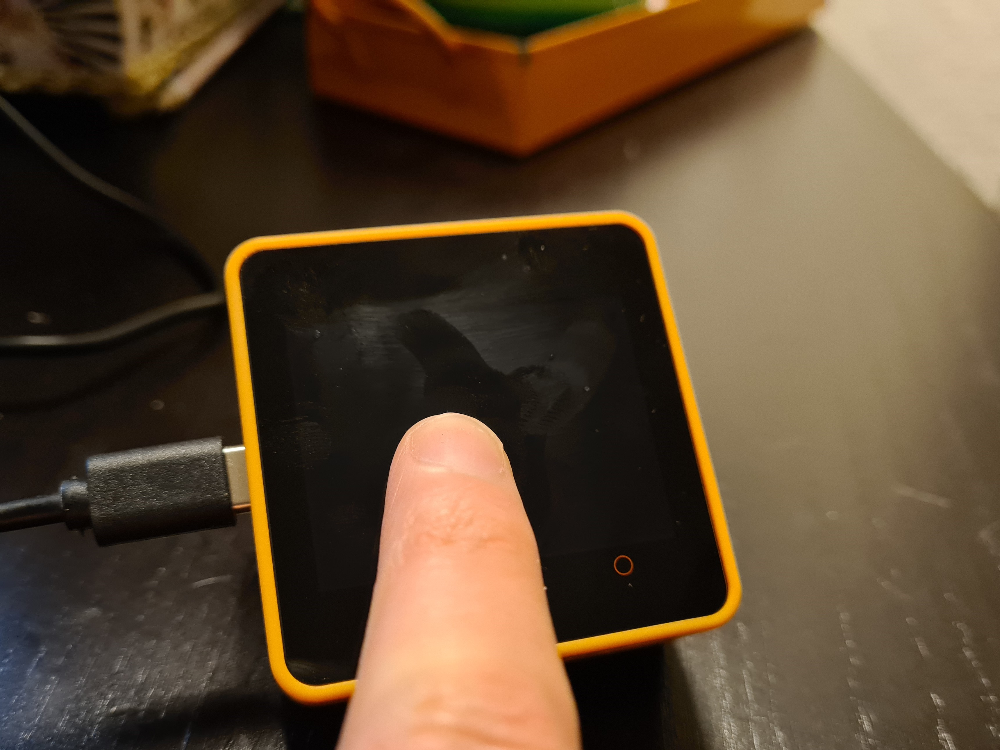
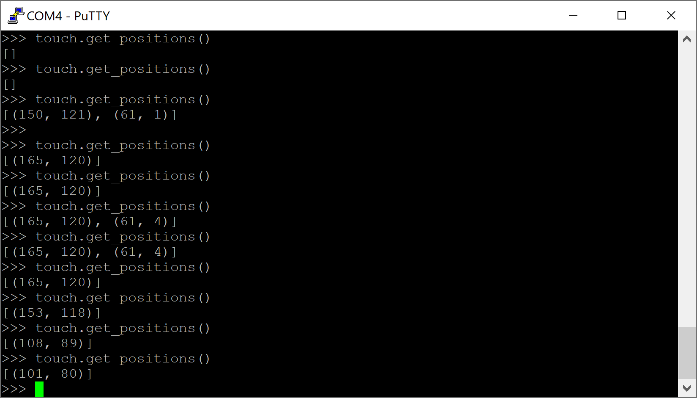

MicroPython I2C driver for the Focus LCDs FT6336U capacitive touch panel controller IC.

Basic usage
===============

The driver simply requires a MicroPython :code:`I2C` object to be instantiated. Refer to your development board's schematics to establish the correct I2C pins.

.. code-block:: python

    from machine import I2C, Pin

    I2C_SDA_PIN = const(21)
    I2C_SCL_PIN = const(22)
    I2C_FREQ = const(400000)
    i2c_bus = I2C(sda=Pin(I2C_SDA_PIN), scl=Pin(I2C_SCL_PIN), freq=I2C_FREQ)

The FT6336U driver can then be instantiated using the :code:`I2C` object. For the simplest operation, use the :code:`touch.get_positions()` method to return the X and Y coordinates of the registered point(s). This will return a maximum of two points. If the device cannot be found, make sure that the IC is powered (for example, if it is connected to a separate power management chip).

.. code-block:: python

    import uFT6336U
    touch = uFT6336U.FT6336U(i2c_bus)

    touch.get_positions()

Use with interrupt
====================

For best results, use the driver with the designated interrupt pin. This way, discreet code can be triggered based on newly registered points.

.. code-block:: python

    INTERRUPT_PIN = const(39)

    def handle_interrupt(pin):
        num_points = touch.get_points()
        if num_points > 0:
            print(touch.get_p1_x(), touch.get_p1_y())
        if num_points == 2:
            print(touch.get_p2_x(), touch.get_p2_y())

    pir = Pin(INTERRUPT_PIN, Pin.IN)

    pir.irq(trigger=Pin.IRQ_RISING, handler=handle_interrupt)

.. image:: docs/get_positions_irq.

Further reading
===================

* `FT6336U datasheet <https://m5stack.oss-cn-shenzhen.aliyuncs.com/resource/docs/datasheet/core/Ft6336GU_Firmware%20%E5%A4%96%E9%83%A8%E5%AF%84%E5%AD%98%E5%99%A8_20151112-%20EN.xlsx>`_

